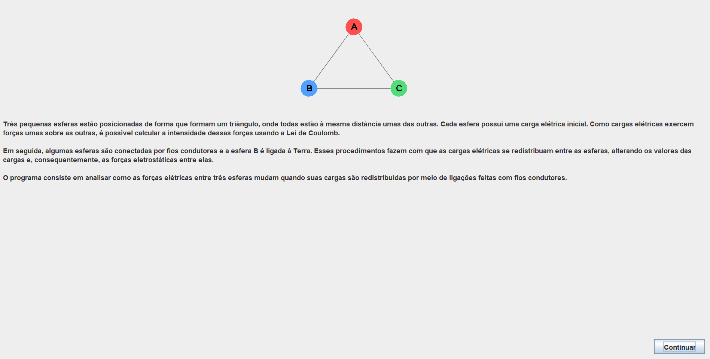
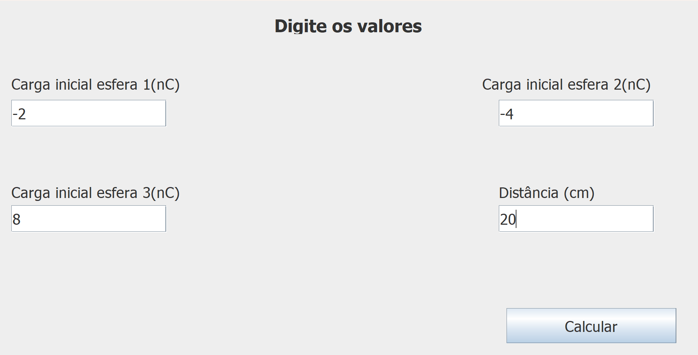
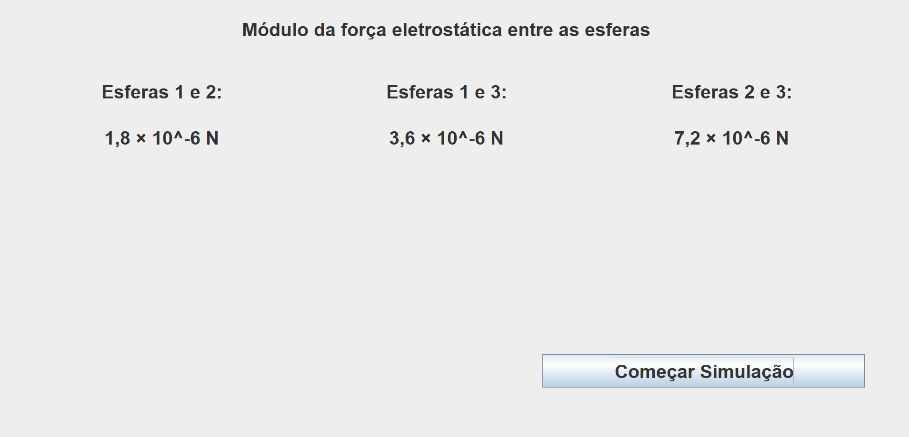
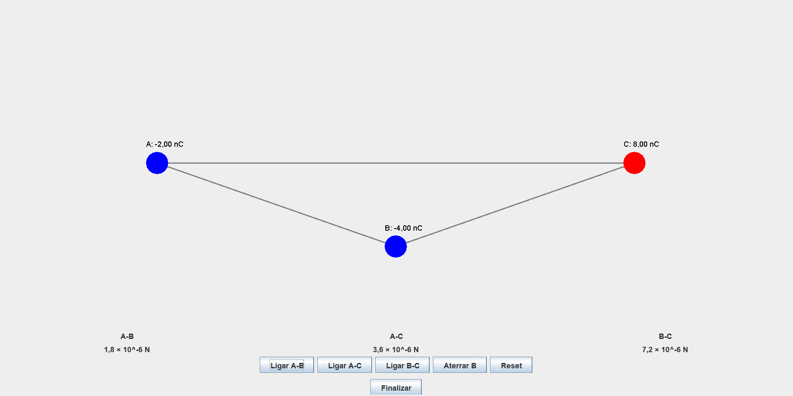

# Simulador de Força Eletrostática

  Três esferas condutoras iguais estão posicionadas de maneira que formam um triângulo equilátero. É feito um experimento onde elas são conectadas e desconectadas por fios condutores e a segunda esfera é ligada à terra. 
  O programa consiste em simular esse experimento e, através da Lei de Coulomb, calcular qual será a carga final de cada esfera e o módulo de força eletrostático entre cada par de esferas. 
  Ele funciona da seguinte maneira: o usuário irá inserir o valor da carga de cada esfera(nC) e a distância(cm) entre cada uma. Após isso serão mostrados os valores do módulo de força entre cada par de esferas e em seguida será feita uma simulação onde o usuário poderá escolher a opção entre ligar o fio entre as esferas e aterrar a segunda esfera. 
  Por fim, quando o usuário decidir encerrar a simulação, serão mostrados os valores da carga final de cada esfera e o módulo eletrostático final entre cada par. 

**Fórmulas:** 
Constante eletrostática = 9x10^9; 
Carga inicial de cada esfera(Conversão para nC) = valor inserido * 1x10^-9; 
Distância(Conversão para cm) = valor inserido/100; 
Módulo de Força Elétrostático = Constante eletrostática * ((|primeira esfera * segunda esfera|) / (distância)²); 
Média entre as cargas = (carga da primeira esfera * carga da segunda esfera) / 2; 

**Imagens da Interface:** 

